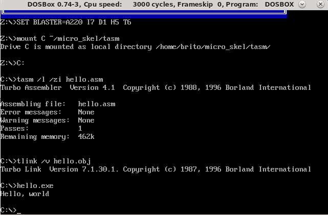

# tasm_hello
Quick start with TASM

## Task definition
First you need to have a working setup with DOS (emulator or native OS) and Turbo Assembler. See my scripts to setup on linux OS (Reference: https://github.com/britovski/micro_skel).

Tests here are performed considering `dosbox` as DOS emulator and the tasm binaries and overlays on `~/micro_skel/tasm` directory.

## Hello World

You can use the hello.asm provided here to test the flow.

First you need to enter `dosbox`

    cd ~/micro_skel/tasm
    dosbox

If you used previously mentioned script, you go directly to tasm directory and in order to assemble `hello.asm` you'll need to follow the sequential steps:

    tasm /l /zi hello.asm
    tlink /v hello.obj
    hello.exe

Then you will see the below screen:

Use Turbo Debugger to check step-by-step instruction flow and have fun checking memory and registers variations.

If you are a VSCode user, maybe you want to see this setup: https://github.com/xsro/VSC-ASMtasks

And if you want to do on rwindows: https://trimtab.ca/2010/tech/tasm-5-intel-8086-turbo-assembler-download/
